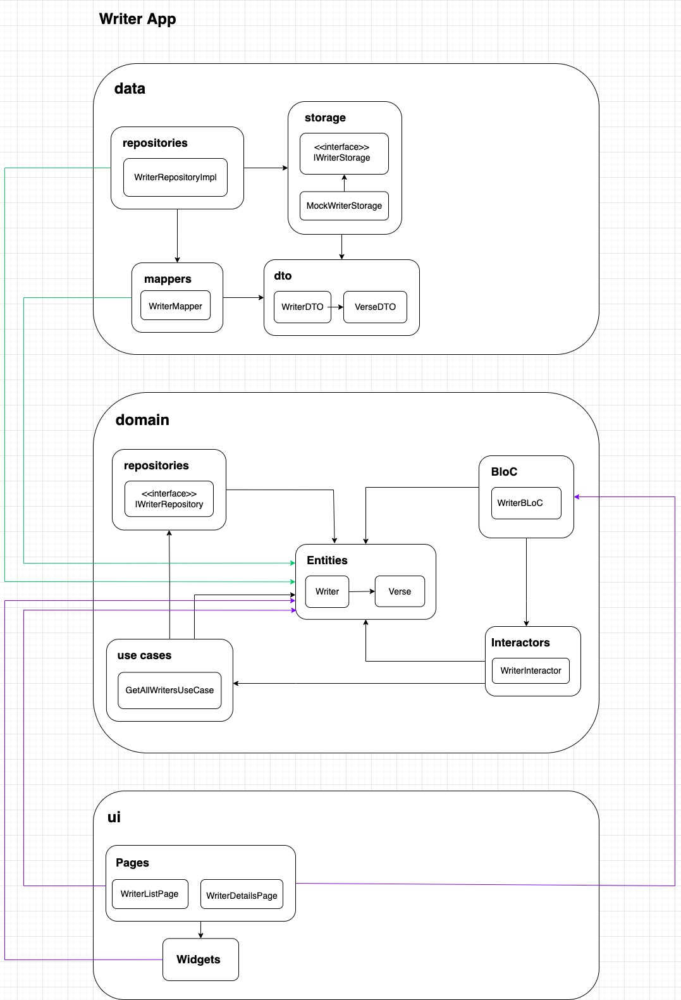
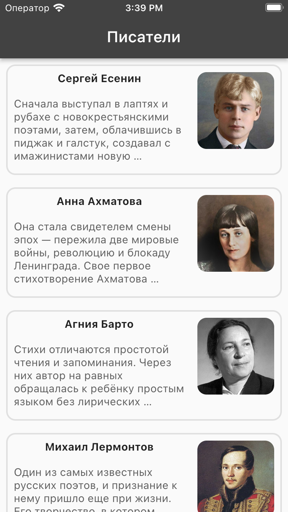
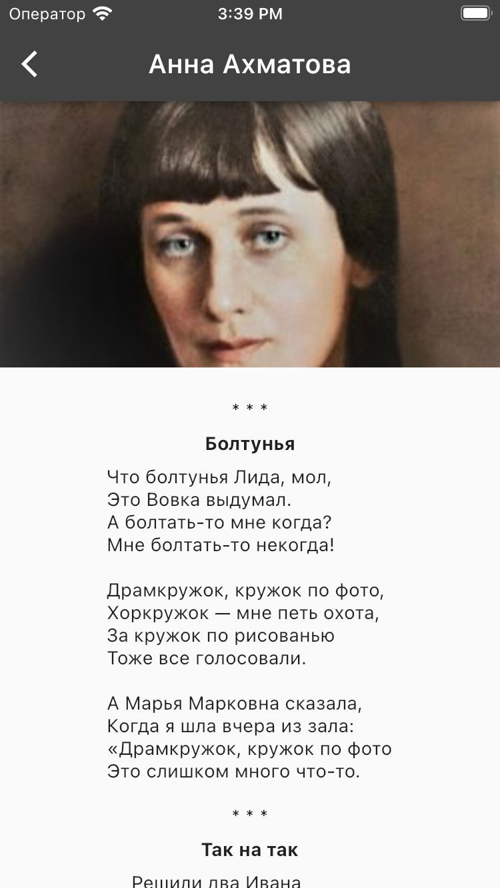
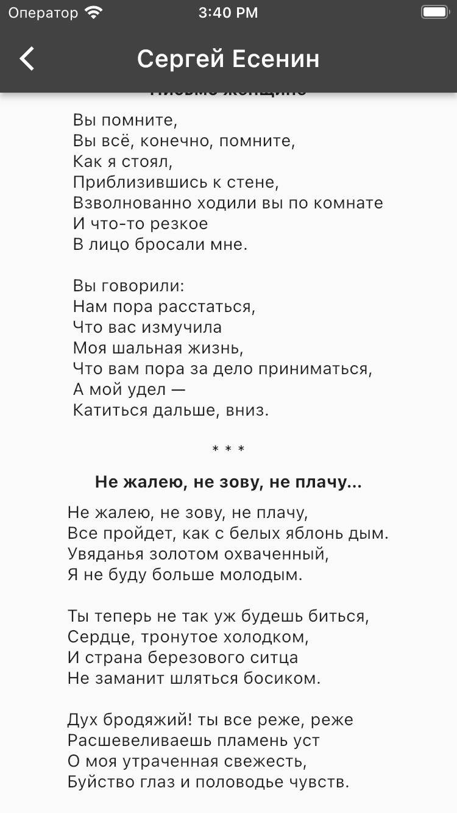
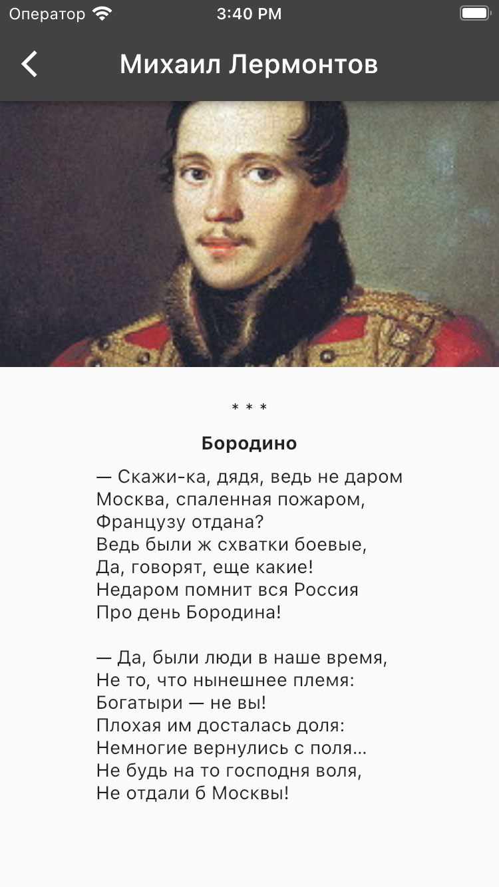

# flutter_writers

<p align="center">
  
</p>

Учебный проект для изучения архитектуры, модульности, менеджеров состояния и DI.

О проекте:

- Dependency management: GetX
- State management: BLoC (не библиотека)
- Архитектура приложения: Clean Architecture, модульность
- Анимация: Hero
- Linters: flutter_lints, dart_code_metrics

<br>

# Модуль - Writer

Отображает писателей и их стихотворения.

О модуле:
- Архитектура приложения: Clean Architecture <br>
     <br>
- Dependency management: GetX
- State management: BLoC (не библиотека)
- Анимация: Hero

Демо:

&nbsp;&nbsp;&nbsp;&nbsp;&nbsp;&nbsp;&nbsp;&nbsp;&nbsp;&nbsp;      


&nbsp;&nbsp;&nbsp;&nbsp;&nbsp;&nbsp;&nbsp;&nbsp;&nbsp;&nbsp;

<br>

# Модуль - About app

Генерирует информацию о проекте через командную строку.

Описание использования находится в пакете модуля:
```
modules/libraries/about_app/README.md
```

Демо:

&nbsp;&nbsp;&nbsp;&nbsp;&nbsp;&nbsp;&nbsp;&nbsp;&nbsp;&nbsp;

<br>

# Об авторе

- 📫 Связаться со мной: yauheni.prakapenka@gmail.com | [linkedin](https://www.linkedin.com/in/yauheni-prakapenka/)
